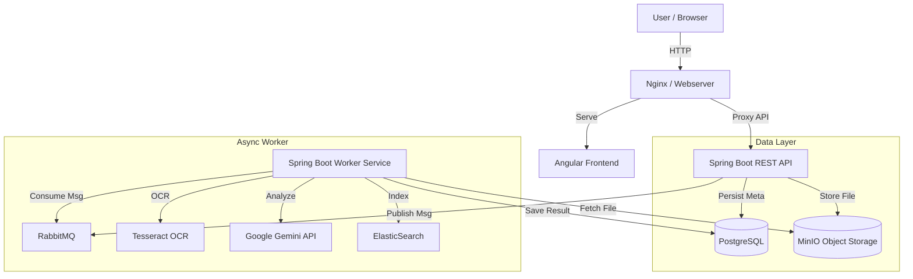

# 📄 Paperless – Verteiltes Dokumentenmanagementsystem

Ein modernes, **Microservice-basiertes System** zur Archivierung, Verarbeitung und Suche von Dokumenten.  
Entwickelt im Rahmen des **Semesterprojekts (SWEN3 / BIF5)**.

Das System deckt den vollständigen Lebenszyklus eines Dokuments ab:  
Vom Upload über die **asynchrone OCR- und KI-Analyse** bis hin zur **Archivierung und Volltextsuche**.  
Zusätzlich integriert es externe Systeme über einen **Batch-Import**.

---

## 🚀 Features & Highlights (Sprint 1–7)

Das Projekt erfüllt alle funktionalen und nicht-funktionalen Anforderungen:

### 📄 Dokumenten-Upload & Management
- Upload via **Web-UI (Angular)** oder **REST API**
- Sichere Speicherung der Originaldatei in **MinIO (S3)**
- Metadaten-Verwaltung in **PostgreSQL**

### 🔍 OCR & Texterkennung
- Automatische Textextraktion mittels **Tesseract OCR**
- Asynchrone Verarbeitung im Worker-Service

### 🤖 KI-Integration (GenAI)
- Automatische Inhaltsanalyse und Zusammenfassung durch **Google Gemini AI**

### 🔎 Intelligente Suche (ElasticSearch)
- Echtzeit-Indizierung aller Dokumenteninhalte
- **Fuzzy-Search** über OCR-Text und Titel

### 🔗 Secure Sharing (Additional Use Case)
- Generierung temporärer Download-Links
- **Audit-Logging** aller Zugriffe (Tracking in DB)

### 🔄 Batch-Import (Sprint 7)
- Automatisierter Import von **XML-Access-Logs** aus einem überwachten Ordner
- Scheduling, Verarbeitung und Archivierung der Quelldateien

---

---

## 🛠️ Technologie-Stack & Architektur

Die Anwendung folgt einer strikten **Hexagonalen Architektur** mit Microservices.

| Layer | Technologie | Details |
| :--- | :--- | :--- |
| **Frontend** | **Angular 20** | Standalone Components, Bootstrap 5, Responsive UI |
| **API Gateway** | **Nginx** | Reverse Proxy für Frontend und Backend |
| **Backend API** | **Spring Boot 3.3** | REST-Schnittstelle, Validierung, Business Logic |
| **Worker Service** | **Spring Boot 3.3** | Asynchrone Verarbeitung (OCR, AI, Indexing), Batch Jobs |
| **Messaging** | **RabbitMQ** | Entkopplung von API & Worker (Queues: `ocr`, `genai`) |
| **Database** | **PostgreSQL 16** | Relationale Datenhaltung (JPA / Hibernate) |
| **Search Engine** | **ElasticSearch 8** | Volltext-Suchindex |
| **Storage** | **MinIO** | S3-kompatibler Object Storage für PDFs |



---

## 👩‍💻 Entwicklungsprozess & Workflow

Um die Qualität und Stabilität des Codes zu gewährleisten, wurde folgender Workflow etabliert (gemäß Rating-Matrix):

- **Version Control (GitFlow):**  
  Nutzung von Feature-Branches (z. B. `feat/sprint7`, `feat/ocr`) und Pull Requests für Code-Reviews vor dem Merge in den `main`-Branch.

- **Issue Tracking:**  
  Verwaltung der Sprints und Tasks über **GitHub Issues / Projects** (Kanban-Board).

- **Qualitätssicherung:**  
  Manuelle Ausführung von **Unit-Tests** und **Docker-Builds** vor jedem Commit zur Sicherung der Stabilität.

---
## 🏃‍♂️ Installation & Start

### Voraussetzungen
- **Docker & Docker Desktop** installiert
- *(Optional)* Google Gemini API Key für KI-Features

---

### 1. Konfiguration (API Key)

Erstellen Sie eine Datei `.env` im Hauptverzeichnis  
(Kopie von `.env.sample`) und tragen Sie Ihren Key ein:

```properties
GEMINI_API_KEY=Ihre_Google_Gemini_API_Key_Hier
```
- Hinweis:
Ohne API Key funktioniert das System vollständig,
lediglich die KI-Zusammenfassung wird übersprungen.

---

### 2. Starten

Führen Sie im Hauptverzeichnis folgenden Befehl aus:

```bash
docker-compose up -d --build

```

- Bitte warten Sie ca. 60 Sekunden, bis alle Container
(insbesondere ElasticSearch) den Status "healthy" melden.

---

## 🖥️ Nutzung & Zugangsdaten

### Web Interfaces

| Dienst        | URL                       | Login                   | Beschreibung                         |
|---------------|---------------------------|-------------------------|--------------------------------------|
| Paperless UI  | http://localhost:8080     | –                       | Hauptanwendung                       |
| API Docs      | http://localhost:8081/swagger-ui/index.html | –     | Backend-Endpunkte                    |
| DB Adminer    | http://localhost:9091     | paperless / paperless   | Server: postgres, DB: paperless      |
| MinIO         | http://localhost:9090     | minioadmin / minioadmin | Dateispeicher                        |
| RabbitMQ      | http://localhost:9093     | guest / guest           | Message Broker                       |

---

## 🧪 Testing & Verifikation

### 1. E2E Integrationstest (Sprint 7 HOWTO)
Der `EndToEndIntegrationTest` überprüft den gesamten Workflow (Upload → Asynchrone Verarbeitung → Suche) gegen die laufende Docker-Umgebung.

**Wichtig:** Da dies ein Systemtest ist, müssen die Container laufen!

* **Technologie:** JUnit 5, RestAssured.
* **Strategie:** Black-Box-Test gegen die Docker-Infrastruktur (Integration Level).

**Voraussetzungen:**
1.  Starten Sie das System: `docker-compose up -d --build`
2.  Warten Sie, bis alle Services (insb. ElasticSearch & MinIO) "healthy" sind.
3.  Stellen Sie sicher, dass eine Test-PDF existiert:
    * Pfad: `services/paperless-rest/src/test/resources/integration-test.pdf`
    * *(Falls nicht vorhanden, legen Sie dort eine beliebige kleine PDF-Datei ab)*.

**Test-Szenario:**
1.  **Upload:** Sendet das PDF an die REST-API.
2.  **Verarbeitung:** Wartet (Polling bis zu 120s), bis der Status `COMPLETED` ist und eine KI-Zusammenfassung existiert.
3.  **Suche:** Prüft, ob das Dokument via ElasticSearch gefunden wird.

**Ausführung:**
Navigieren Sie in das Backend-Verzeichnis und starten Sie den Test:

```bash
cd services/paperless-rest
mvn test -Dtest=EndToEndIntegrationTest
```

---

### 2. Batch-Import testen (Sprint 7)

- Der Batch-Service importiert XML-Dateien aus dem Ordner `scan_input`.

- Kopieren Sie die Datei `sample_access_log.xml` in den Ordner:

```bash
# Windows
Copy-Item sample_access_log.xml -Destination scan_input/

# Mac / Linux
cp sample_access_log.xml scan_input/
```

Der Batch-Import ist als Scheduled Task implementiert. Zu Demo-Zwecken läuft er alle 30 Sekunden (statt wie in Produktion täglich um 01:00 Uhr). Warten Sie kurz...

Prüfen Sie:

- Die Datei wurde nach `scan_archive` verschoben

- In der Datenbank-Tabelle `access_log` sind neue Einträge sichtbar

---

### 3. Share-Funktion testen

- Klicken Sie im UI auf das **„Teilen“-Icon** eines Dokuments
- Öffnen Sie den generierten Link in einem **Inkognito-Fenster**
- Das Dokument wird geladen und der Zugriff in der **Datenbank protokolliert**

---

## ✅ Erfüllung der Anforderungen (Rating Matrix)

| Kategorie        | Status | Implementierung                                                       |
|------------------|--------|------------------------------------------------------------------------|
| Use Cases        | ✅     | Upload, OCR, Search, Sharing vollständig umgesetzt                     |
| Architecture     | ✅     | Saubere Trennung (API vs. Worker), Docker-Containerisierung            |
| Non-Functional   | ✅     | Asynchrone Queues, Logging, Exception Handling                         |
| Unit Tests       | ✅     | Business-Logik Tests mit Mockito (>70 % Coverage)                      |
| Integration      | ✅     | E2E Tests gegen Docker-Umgebung (RestAssured)                                        |
| Batch Job        | ✅     | Scheduled XML Import & Archivierung                                    |
| Validation       | ✅     | Validierung im Frontend (Filetype) & Backend (DTOs)                    |

---

**Entwickler:** Mathuppurathu Martin & Wahba Fawzy
**Semester:** Winter 2025/26
